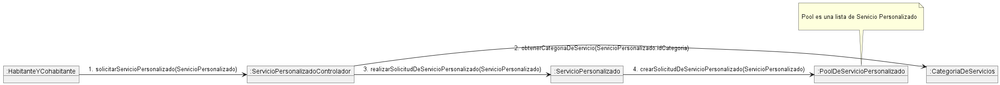

# docs-condominio

## Casos de Uso
### CU16: Gestionar Solicitud de Servicio Personalizado

**Tipo de Caso de uso:** Primario

**Actores:** Habitante y Cohabitante (primario), Proveedor (secundario)

**Precondicion:** El habitante ya inicio sesion.

**Resumen**: El habitante selecciona la categoría de servicio que desea recibir y proporciona una breve descripción del servicio personalizado que desea, junto con la prioridad de su solicitud (Alta, Media, Baja), la fecha y la hora de preferencia para la visita del proveedor, y adjunta fotos relevantes. A continuación, el habitante envía esta solicitud al Pool de Servicio Personalizado, donde los proveedores de la comunidad pueden revisarla e inspeccionarla. El sistema envia confirmacion de que se creo y se envio la solicitud de servicio personalizado.

**Poscondicion:** La solicitud de servicio personalizado se envio con exito y espera una respuesta de algun proveedor perteneciente a la comunidad de proveedores.

**Caminos Alternativos:**
1.  **Modificar Servicio Personalizado Solicitado:** El habitante modifica el servicio personalizado. El sistema reflejara esta modificacion en el pool de servicio personalizado.
2. **Eliminar Servicio Personalizado Solicitado:** El habitante cancela la solicitud de servicio personalizado. El sistema retira el servicio personalizado creado.

3. **Descripcion Incompleta:** Si el habitante no proporciona una descripción completa del servicio deseado, el sistema puede solicitar más detalles antes de permitir que continúe con la solicitud.

#### Diagrama de Caso de Uso

#### Diagrama de Secuencia

#### Diagrama de Colaboracion

#### Interfaz

### CU17: Gestionar Pool de Servicios Personalizados
**Actores:** Proveedor (p), Habitante y Cohabitante (s), Administrador de Condominio (s).

**Precondicion:** El proveedor ya ingreso sesion e ingreso al Pool de Servicios Personalizados

**Resumen**: El proveedor revisa las solicitudes de servicio personalizado enviadas por usuarios asociados a condominios. El proveedor puede visualizar los detalles de cada servicio personalizado, incluyendo nombre, descripción, fecha de inicio, hora de inicio y fotos adjuntas. Posteriormente, el proveedor selecciona el servicio deseado y agrega un precio preferencial, para luego enviar la respuesta al solicitante.

**Poscondicion:** El sistema envia una respuesta confirmando de que se envio correctamente.

**Caminos Alternativos:**
1.  **El servicio ya no esta:** El proveedor intenta responder a solucitud pero, el sistema envia notificacion de que el servicio personalizado fue eliminado o ya fue seleccionado por otro proveedor.
2. **Ver respuestas:** El proveedor puede ver todas sus respuestas a todos los servicios personalizados. 
3. **Eliminar respuesta:** El proveedor decide eliminar su respuesta y el sistema retira su respuesta, confirmando con una notificacion.
4. **Modificar respuesta:** El proveedor decide modificar su respuesta y el sistema notifica de que se modifico exitosamente. 

### CU18: Gestionar Respuesta Solicitud de Servicio Personalizado
**Actores:** Habitante (p), Administridor de Condominio (p), Proveedor (s)

**Precondicion:** El habitante ha creado su solicitud de servicio personalizado y uno o varios proveedores de la comunidad han respondido a la solicitud.

**Resumen:** El habitante o administrador del condominio accede a la lista de respuestas de sus solicitudes de servicio personalizado y evalúa cuál de ellas ofrece la mejor combinación entre calidad y precio. Pueden seleccionar entre descartar o aceptar una respuesta según sus preferencias.

**Poscondicion:** El habitante acepto una respuesta y el proveedor es notificado al respecto para realizar el servicio personalizado. 

**Caminos Alternativos:**
1.  **Cancelar solicitud:** El solicitante decide cancelar el servicio. El sistema notifica al proveedor.
2. **Respuesta inexistente:** La respuesta fue elimina. El sistema notifica al solicitante de ello. 

#### Diagrama de Caso de Uso

#### Diagrama de Secuencia

#### Diagrama de Colaboracion

## Modelo de Dominio

## Diagrama de Clases de Diseño

## Diagrama de Paquetes