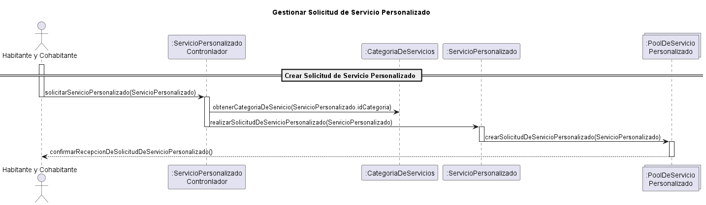
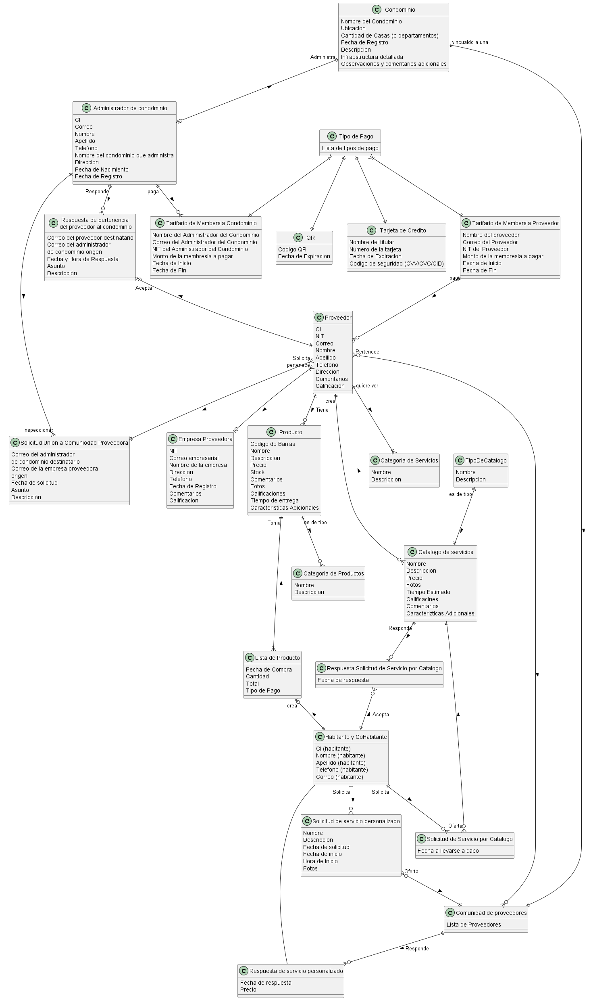

# docs-condominio

## Casos de Uso
### CU16: Gestionar Solicitud de Servicio Personalizado

**Tipo de Caso de uso:** Primario

**Actores:** Habitante y Cohabitante (primario), Proveedor (secundario)

**Precondicion:** El habitante ya inicio sesion.

**Resumen**: El habitante selecciona la categoría de servicio que desea recibir y proporciona una breve descripción del servicio personalizado que desea, junto con la prioridad de su solicitud (Alta, Media, Baja), la fecha y la hora de preferencia para la visita del proveedor, y adjunta fotos relevantes. A continuación, el habitante envía esta solicitud al Pool de Servicio Personalizado, donde los proveedores de la comunidad pueden revisarla e inspeccionarla. El sistema envia confirmacion de que se creo y se envio la solicitud de servicio personalizado.

**Poscondicion:** La solicitud de servicio personalizado se envio con exito y espera una respuesta de algun proveedor perteneciente a la comunidad de proveedores.

**Caminos Alternativos:**
1.  **Modificar Servicio Personalizado Solicitado:** El habitante modifica el servicio personalizado. El sistema reflejara esta modificacion en el pool de servicio personalizado.
2. **Eliminar Servicio Personalizado Solicitado:** El habitante cancela la solicitud de servicio personalizado. El sistema retira el servicio personalizado creado.

3. **Descripcion Incompleta:** Si el habitante no proporciona una descripción completa del servicio deseado, el sistema puede solicitar más detalles antes de permitir que continúe con la solicitud.

#### Diagrama de Caso de Uso

#### Diagrama de Secuencia

#### Diagrama de Colaboracion

#### Interfaz

## Modelo de Dominio

## Diagrama de Clases de Diseño